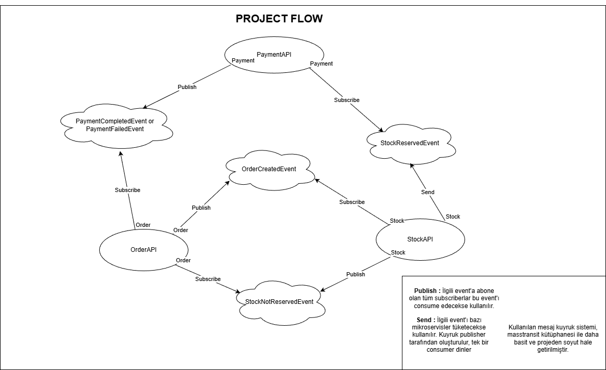

 <h1>Mikroservis Mimari - Asenkron (Event Driven) İletişim</h1>
<h3>1- Giriş</h3>
<p>
Projede mini bir e-ticaret örneği üzerinden gidilerek mikroservis mimari kullanılmış olup asenkron - event driven iletişim üzerinden gidilmiştir. Üç servis (Order, Stock, Payment) birbirleriyle olay tabanlı haberleşir ve paylaşılan kontratlar(kuyruk bilgileri) Shared projesinde tutulur.
</p>

<h3>2- Akış</h3>

<p>Öncelikle kullanıcı bir sipariş oluşturur. Bu kısımda order mikroservis çalışır. Sipariş başarıyla oluşturulduktan sonra order mikroservis'i bir event oluşturur, rabbitmq'ya masstransit üzerinden bu event'ı gönderir. Ardından bu event'ı işleyecek bir kuyruk oluşturulur ve stockapi'de yer alan consumer ile order'dan fırlatılan event oluşturulan kuyruk ile dinlenip yakalanır. Stock mikroservis'inde gerekli kontrol yapılır eğer ürün stokda yoksa stock mikroservisinden gerekli event fırlatılır ve order mikroservis'i bunu yakalayıp consume edip order'ın durumunu günceller. Eğer stok başarılı ise payment mikroservis'i için bir kuyruk oluşturulur ve ilgili event kuyruğa send edilir. Payment mikroservis'i bu kuyruğa subscribe olur ve yakalayıp consume eder. Payment işleminin de başarılı veya başarısız olma durumuna göre bir event daha fırlatılır ve ilgili order'ın status'u buna göre güncellenir.</p>

<h3>3- Akışı Anlatan Mimari Şema</h3>



<h3>4- Oluşturulan Mikroservisler</h3>
<ul>
    <li>OrderAPI</li>
    <li>StockAPI</li>
    <li>PaymentAPI</li>
</ul>

<h3>5- Kullanılan Teknolojiler</h3>
<ul>
    <li>MassTransit + RabbitMQ (CloudAMQP) ile event-driven iletişim</li>
    <li>ASP.NET Core Web API (.NET 9)</li>
    <li>SQL Server (Order servisi), MongoDB (Stock servisi)</li>
    <li>EF Core, MongoDB.Driver</li>
</ul>

### 6- Örnek API İstekleri

#### OrderAPI

**POST** `/api/orders`  
**Content-Type:** `application/json`

```json
{
  "buyerId": "e6e5c2d2-2a9c-4c0f-b7ee-3d4d2f0c9c11",
  "orderItems": [
    { "productId": "f1f1f1f1-1111-4444-9999-aaaaaaaaaaaa", "count": 2, "price": 50 },
    { "productId": "f2f2f2f2-2222-5555-8888-bbbbbbbbbbbb", "count": 1, "price": 120 }
  ]
}
```

<h3>7- Oluşturulan Kuyruklar ve İşlevleri</h3>
- <b>stock-order-created-event-queue:</b> StockAPI Mikroservis'i tarafından dinlenir ve OrderCreatedEvent verisini işler(consume eder)<br>
- <b>payment-stock-reserved-event-queue:</b> PaymentAPI Mikroservis'i tarafından dinlenir ve StockReservedEvent verisini işler (consume eder)<br>
- <b>order-payment-completed-event-queue:</b> Order Mikroservis'i tarafından dinlenir ve PaymentCompletedEvent verisini işler (consume eder)<br>
- <b>order-stock-not-reserved-event-queue:</b> Order Mikroservis'i tarafından dinlenir ve StockNotReservedEvent verisini işler (consume eder)<br>
- <b> order-payment-failed-event-queue:</b>  Order Mikroservis'i tarafından dinlenir ve PaymentFailedEvent verisini işler (consume eder)

## 8- Durum Geçişleri (Order)
- Başlangıç: Suspend
- Stok başarısız: Failed
- Ödeme başarısız: Failed
- Ödeme başarılı: Completed

## 9- Notlar
- Uygulamadaki mikroservis ve event driven güdümlü asenkron iletişimi örneklemek açısından paymentapi mikroservis'inde fake bir ödeme kullanılmıştır.
- StockAPI mikroservis'i ayağa kalktığında db'de hiç stok verisi yoksa örnek seed stok dataları gönderir.


